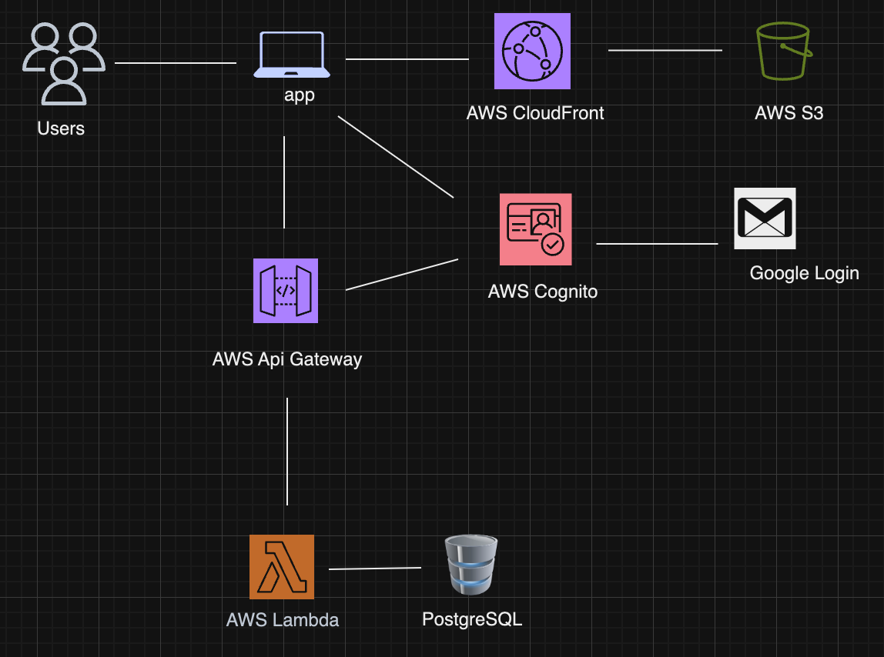

# Estilo Calico Admin Portal Frontend
 


[Estilo Calico Admin Portal](https://admin.estilocalico.com) is a custom cloud-based content management system.

Deployed in AWS, React frontend, Python/Flask backend, Terraform for infrastructure as code.

## How the CMS works
The Estilo Calico Admin Portal allows users to manage and administer content of the [Estilo Calico](https://www.estilocalico.com) website.

## Frontend architecture


## Installation/setup
- Clone the repo
- Install dependencies `npm i`
- Run `npm start` to start running webpack in development mode

### Webpack and compile-time constants
Webpack set up includes the ['DefinePlugin'](https://webpack.js.org/plugins/define-plugin/) under plugins in the `webpack.config.js` file. The 'DefinePlugin' allows you to create global constants which can be configured at compile time. This is useful because I have different API endpoints for production and development and creating these contants allows me to have the right configuration for both development and production. 

## Test Frontend and Backend locally
To test the frontend and backend locally clone the [Estilo Calico Admin Portal backend repo](https://github.com/c-arriagada/es-flask-app). Follow the README to set up your backend. Start your flask server. 
```bash
flask --app app.py --debug run
```
After you've started your server start your React application.
```bash
npm start
```

## Deployment

#### Set up cloud infrastructure
See [cloudInfrastructure.md](docs/cloudInfrastructure.md)

#### Build
`npm run build`
After you run this command webpack will create a folder called `dist` in your root directory. If you rerun this command the files in the folder will be replaced by files with your most up-to-date code.

#### Deploy
```bash
./bin/deploy
```
This script copies the files in your dist folder into your AWS s3 bucket and also invalidates the cache for your AWS CloudFront distribution. Allowing users to see the most up-to-date version of your frontend upon deployment. 


